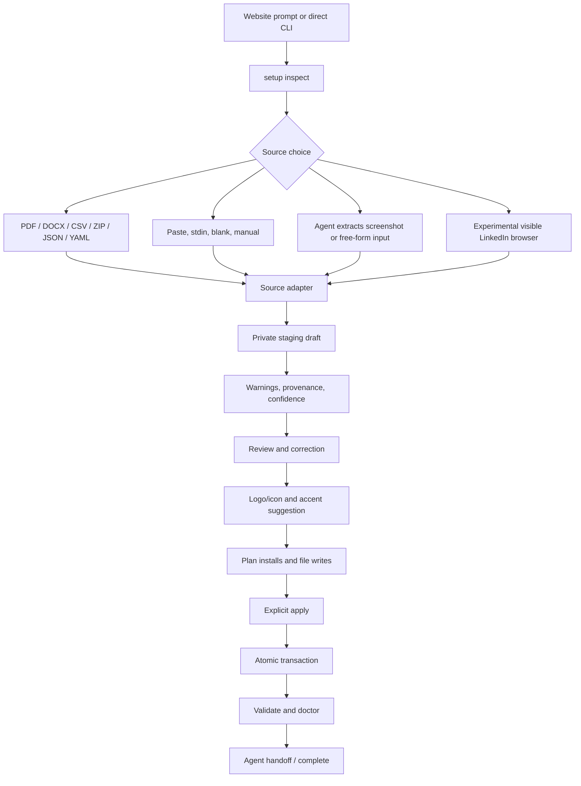

# Simplified Stint Setup and Local Profile Import - Plan

## Goal Capsule

Make Stint setup a single, agent-readable, resumable CLI workflow. It must discover the consumer project, collect career history from several local sources, preview uncertain fields, apply only confirmed changes, and leave supported Next App Router/Vite projects with a working integration. Unsupported projects receive a concrete handoff rather than a false promise of automatic completion. The website must hand agents to this workflow instead of teaching them to invent file locations or maintain a second setup wizard.

The Stint repository owns the CLI protocol, source adapters, canonical agent guide, and runtime default. The `portfolio-mac` repository consumes the published guide and exposes the website handoff. Existing `init`, `add`, `import`, and `validate` commands remain compatible primitives.

The plan stops when the new setup protocol, supported source paths, experimental browser path, website routes, and horizontal default are implemented and verified against packed packages. It does not publish a hosted LinkedIn scraper or require an account with a third-party import or logo provider.

## Product Contract

### Summary

`npx @macworks/stint-cli setup` becomes the primary Stint onboarding path. In a TTY it guides a person through project detection, source selection, consent, review, and apply. In a non-TTY it accepts one structured answers payload and emits stable JSON for an agent to relay. A copied website prompt tells the agent to inspect the project and run this command.

LinkedIn PDF export is the supported convenience path. Existing LinkedIn CSV/ZIP exports remain supported. A visible, local, signed-in browser importer is an experimental opt-in because LinkedIn prohibits third-party scraping and because its DOM is unstable. No hosted importer is in scope.

### Problem Frame

The current website prompt restates schema and implementation steps instead of invoking the CLI. Its advertised `init` command cannot run without manual project, config, data, and conflict flags. The CLI only accepts one local file per import and has no source chooser, project inspection, review state, or integration handoff. The website links to missing `/stint/llms.txt` and `/stint.md` routes and hard-codes an older package version.

People without a LinkedIn archive must currently assemble CSV or ZIP files by hand. The product needs a useful path from a LinkedIn PDF, ordinary résumé, pasted history, structured data, or an agent-extracted screenshot without adding a hosted service or sending profile data to Stint servers.

The runtime currently resolves an omitted orientation through responsive mode. At normal desktop widths that means vertical, which conflicts with the intended horizontal default.

### Requirements

#### CLI and agent setup

- R1. Provide a zero-argument TTY entry point, `setup`, that discovers the project and presents the next required decision instead of requiring manual `--project`, `--config`, and `--data` paths.
- R2. Provide one structured non-interactive setup answers payload through `--answers <file|->` for project, source, session, consent, review, conflict, and integration decisions. Keep flags for execution-semantic controls such as `--source`, `--json`, `--dry-run`, explicit apply, and experimental browser opt-in; retain path flags only as advanced compatibility escape hatches.
- R3. Emit stable machine-readable setup states and remediation codes. At minimum support `needs_project_choice`, `needs_source_choice`, `needs_linkedin_consent`, `waiting_for_browser_sign_in`, `needs_review`, `ready_to_apply`, `complete`, `complete_with_handoff`, and `failed_recoverably`.
- R4. Inspect the current directory and safe ancestors for the package manager, lockfile, framework, workspace boundary, existing Stint dependency, existing generated data, likely component/layout/style entry points, and ambiguous integration points.
- R5. Show a complete proposed write/install plan before mutation. Unsupported or ambiguous projects must produce a concrete handoff with proposed paths rather than guessing.
- R6. Keep `--json`, `--dry-run`, and the existing lower-level commands composable. Non-TTY invocations must never block on a prompt.

#### Source choices and privacy

- R7. Keep JSON, YAML, LinkedIn CSV, and LinkedIn ZIP as deterministic local imports with the existing bounded-read, archive, validation, and transaction guarantees.
- R8. Add a supported PDF path for LinkedIn's “Save profile as PDF” output and ordinary résumé PDFs. The first-run source menu should expose only three goals: `Import a file`, `Paste or enter history`, and `LinkedIn browser (experimental)`. Auto-detect PDF, DOCX, CSV, ZIP, JSON, and YAML underneath `Import a file`; keep blank/manual entry and agent-produced canonical JSON under `Paste or enter history`.
- R9. Treat screenshot, free-form résumé, personal-site URL, and other unstructured inputs as agent-assisted sources in v1. The guide must tell an agent to convert them to a canonical local draft and pass that draft to the CLI; bundled OCR and hosted model calls are out of scope.
- R10. Offer a visible local LinkedIn browser import only behind an explicit experimental flag and a separate consent step. Lead with plain language: “We don't send your profile or project data to Stint servers; setup runs on your device.” Immediately qualify that the visible browser necessarily connects to LinkedIn, the person signs in there, Stint never receives credentials, and agent-assisted sources cross the agent provider boundary described in R34.
- R11. If browser import is declined, unavailable, blocked by sign-in, CAPTCHA, 2FA, policy, selector drift, or network failure, preserve the session and offer PDF, CSV/ZIP, paste, or manual alternatives without writing partial canonical data.

#### Draft, enrichment, and integration

- R12. Normalize every source into one private staging model before it reaches `StintConfig`. Staging records must carry provenance, missing-field warnings, and field-level confidence without adding transient metadata to the public runtime schema.
- R13. Require review of low-confidence dates, role grouping, employer boundaries, locations, and logo matches. Only confirmed data may enter generated canonical JSON, typed data, and consumer integration files.
- R14. Reuse the existing compare-and-swap transaction for multi-file apply. A failed apply, concurrent target change, cancellation, or validation error must leave the consumer project unchanged.
- R15. Support automatic integration only for tested Next App Router and Vite React shapes in v1. Install or update the runtime dependency through the detected package manager only after the plan is confirmed. Unknown shapes receive canonical data plus a clear agent handoff.
- R16. Keep logos and colors outside `StintConfig`. When a verified company domain or locally captured image exists, copy a bounded safe asset into the consumer project, generate a separate presentation manifest, and suggest a contrast-safe accent. Always allow initials or a manual asset override.

#### Distribution and presentation

- R17. Store the canonical agent instructions in the CLI package. Generate or export the copied prompt, Markdown guide, `llms.txt`, and optional thin `SKILL.md` from that source; no surface may carry an independent workflow or schema.
- R18. Make the website's primary setup CTA the published CLI command and make `/llms.txt`, `/stint.md`, and their compatibility aliases resolve to real content. Display the installed package version rather than a hard-coded version.
- R19. Change the omitted `Stint` orientation to horizontal. Keep explicit `vertical` and `responsive` behavior unchanged, and document them as opt-ins.
- R20. Preserve redacted machine output by default. Credentials, cookies, browser profile paths, raw page HTML, and raw résumé text must never appear in agent-facing output. A setup session may return normalized employer, role, date, and location fields for review only after the person has selected the source and opted into agent-visible review; the guide must state that this data enters the agent transcript/provider boundary.
- R21. Audit the Node runtime floor and explain it before collecting data. Lower it only if the dependency and packed-consumer matrix proves the lower floor; otherwise retain the floor and make the preflight actionable.

#### Flag and command surface

- R22. Make discovered project, config, data, conflict, format, and reference-month values the defaults for the primary setup/import/validate flow. Do not require users or agents to repeat values the CLI can safely infer.
- R23. Make the quick surface small: `setup [source]`, `import <source>`, `validate`, and `doctor` should need only a source/path when one cannot be inferred. Keep `--json`, `--dry-run`, and explicit apply/consent flags because they change execution semantics.
- R24. Auto-detect format from a regular input file and use the current month by default. Keep `--format` and `--reference-month` as advanced overrides for unusual extensions, fixtures, and reproducible historical imports.
- R25. Keep `--project`, `--config`, `--data`, `--conflict`, and detailed `add` field flags as compatibility escape hatches, but hide them from quick help, mark them advanced, and do not emit them in the website prompt.
- R26. Add an interactive `add` path and a canonical-file/stdin path so a person or agent can add an employer or role without composing a long list of field flags. Existing flag-based `add` remains supported until a later major release.
- R27. Define `setup linkedin --url <profile-url>` as the explicit experimental browser entry point. Validate an HTTPS LinkedIn profile URL before opening Chrome, navigate to that URL before the human sign-in gate, and return a redacted remediation state for missing, malformed, or changed URLs.
- R28. Define a package-manager runner for the tested managers. It must preview the exact command and lockfile effect, enforce timeout/output-redaction/network/script policy, support cancellation, and return an install receipt that can resume setup after an integration failure.
- R29. Make the website consume the exact published `@macworks/stint-cli` version that exports the canonical guide. A site build must fail when the package, guide version, copied prompt, and route output disagree or when the advertised package is not available.
- R30. Restrict company-site enrichment to user-confirmed HTTPS hosts with DNS/redirect checks that reject loopback, private, link-local, metadata, and unexpected origins. Bound response size and content type, reject active SVG content, and make enrichment independently skippable.
- R31. Constrain browser navigation and requests after the initial LinkedIn URL validation. Block unexpected top-level redirects, popups, frames, and third-party resource origins; allow only the LinkedIn hosts required for the visible flow and report blocked navigation as recoverable.
- R32. Create session and browser directories with private permissions and no-follow/symlink-safe operations. Track the owned browser process, terminate it on cancel/timeout, expire stale checkpoints, and verify cleanup after normal and interrupted exits.
- R33. Run package-manager commands with shell execution disabled, an argv allowlist, exact package/version and registry expectations, sanitized environment, explicit lifecycle-script policy, lockfile diff/integrity checks, and redacted output.
- R34. Before an agent receives a screenshot, résumé, or free-form history, show a provider-boundary warning and a local-only alternative. The guide must distinguish local CLI processing from the agent/model provider's handling and retention policy.
- R35. Apply structural resource limits to every new source path, including stdin, PDF/DOCX extraction, staging records, field lengths, diagnostic counts, and generated assets.
- R36. Keep the browser importer behind a measurable lifecycle gate. Promotion requires a maintainer-owned decision record, at least ten sanitized DOM fixtures, five consented smoke runs, and zero credential, origin, privacy, or cleanup failures. Sunset it after LinkedIn policy invalidation or two releases without a maintained fixture set and owner; until then it remains experimental and never blocks core setup.

### Flag slimming contract

The current README exposes path and policy plumbing on every command. The setup plan keeps those primitives working for scripts, but removes them from the first-run path:

| Current shape | Slim shape | Treatment |
|---|---|---|
| `init --project DIR --config FILE --data FILE --conflict POLICY` | `setup` or `setup <source>` | Discover project/config/data; default conflict to abort; preserve the old form as advanced compatibility. |
| `import INPUT --format FORMAT --project DIR --config FILE --data FILE --conflict POLICY --reference-month YYYY-MM` | `import INPUT` | Infer format, paths, conflict abort, and current reference month; keep overrides under `help --advanced`. |
| `validate --project DIR --config FILE [--reference-month YYYY-MM]` | `validate` | Inspect the detected project and use the current month unless overridden. |
| No dedicated diagnostics command | `doctor` | Report discovery, dependency, integration, and validation findings without mutation. |
| `add employer` with ten-plus field/path flags | TTY `add employer` or `add employer --from -` | Prompt one field at a time or accept one canonical JSON object; retain legacy flags for compatibility. |
| One flag per non-TTY decision | `setup --answers answers.json` or `setup --answers -` | Use one versioned local payload for choices; reject malformed/incomplete answers with a remediation state. |

Only flags that change execution semantics remain on the quick surface: `--json`, `--dry-run`, explicit apply/consent, `--source`, and the experimental browser opt-in. The website prompt and canonical guide must never emit the advanced path, conflict, format, date, or field flags.

The answers payload is versioned and local; it is not a second CLI grammar. The minimum shape is:

```json
{
  "version": 1,
  "project": { "path": "." },
  "source": { "kind": "file", "path": "profile.pdf" },
  "session": { "action": "new" },
  "consent": { "linkedinBrowser": false, "agentProviderBoundary": false },
  "review": { "mode": "interactive" },
  "conflict": "abort",
  "integration": { "mode": "auto" },
  "apply": false
}
```

`project`, `source`, `session`, `consent`, `review`, `conflict`, `integration`, and `apply` are the only decision groups in v1. Omitted safe values are inferred; malformed or incomplete payloads return a remediation state. Credentials, cookies, browser profile paths, raw source contents, and arbitrary subprocess argv are never accepted as answers fields.

### Actors

- A1. Person setting up a Stint timeline. They choose a source, sign in only in a visible browser when they opt in, review extracted records, and approve writes.
- A2. Coding agent launched from the website prompt. It inspects the project, invokes `setup`, relays structured states, and performs only the approved integration steps.
- A3. Stint CLI. It owns discovery, local parsing, staging, consent gates, enrichment, planning, validation, and atomic apply.
- A4. Website documentation surface. It distributes the canonical guide and points to the CLI; it does not receive career data.

### User Flows

#### F1. Website prompt to agent setup

The person copies the short prompt. The agent reads the canonical guide, runs `setup` from the detected project root, receives `inspect`/state JSON, and relays the next choice. The agent must not invent file paths. After review, the CLI writes the selected integration and the agent runs the consumer validation step.

#### F2. TTY setup with a supported local source

The person runs `setup`, confirms the detected project, and sees three source goals: Import a file; Paste or enter history; LinkedIn browser (experimental). Choosing Import a file reveals supported formats and auto-detects PDF, DOCX, CSV, ZIP, JSON, or YAML. Choosing Paste or enter history offers canonical JSON, pasted résumé text, stdin, or blank/manual entry. The person reviews the normalized draft and planned writes, then confirms apply. Cancel at any gate leaves no canonical mutation.

#### F3. LinkedIn PDF fallback

The person chooses the supported LinkedIn PDF route. The CLI extracts text locally, maps recognizable employers, roles, dates, and locations into staging, marks uncertain fields, and asks for review. If the PDF is unavailable, image-only, localized beyond the parser, or incomplete, the CLI offers paste/manual entry or an agent-assisted draft.

#### F4. Experimental browser import

The person first sees the experimental status, LinkedIn policy/maintenance warning, and exact privacy/network boundary. A distinct accept action launches a visible system Chrome instance with a dedicated temporary profile. The person signs in and completes any MFA/CAPTCHA themselves. The CLI captures only the rendered career data and visible logo references needed for the draft, then closes and cleans the profile. Browser cancellation, closure, auth failure, selector drift, or policy checkpoint returns a resumable state and offers F2/F3 alternatives.

#### F5. Review, enrichment, and apply

The person or agent reviews grouped roles, normalized `YYYY-MM` dates, null current ends, locations, provenance, missing values, logo matches, and suggested accents. The CLI displays the exact files and package-manager action it will change. Apply uses the existing atomic transaction and then validates the canonical config and supported consumer build.

#### F6. Unsupported or already configured project

Discovery finds an ambiguous source root, unsupported framework, existing Stint integration, or a changed target. The CLI returns `complete_with_handoff` with the detected facts, safe proposed paths, and the next manual/agent action. Re-running the same session is idempotent and never silently duplicates entries.

### Acceptance Examples

- AE1. Running `setup` in a supported Vite project with no arguments reaches `needs_source_choice` without requiring a path flag.
- AE2. Running the website-copied prompt in a project with a nested app causes the agent to receive proposed paths from discovery rather than search until it guesses one.
- AE3. Non-TTY `setup --json` with no source returns a remediation state and exits without reading stdin or opening a browser.
- AE4. Declining LinkedIn consent opens no browser and creates no session, draft, or project write.
- AE5. Accepting experimental browser consent opens a visible dedicated profile. Password, MFA, CAPTCHA, and LinkedIn permission controls remain human-operated.
- AE6. Closing the browser during sign-in returns a resumable state without emitting cookies, page HTML, or credentials.
- AE7. A PDF with an uncertain end month produces a draft warning and blocks apply until the value is confirmed or intentionally left unresolved.
- AE8. A failed logo fetch leaves the career import usable with an initials placeholder and no failed network request blocking apply.
- AE9. A concurrent edit to a generated data file aborts the apply and restores every file touched by the transaction.
- AE10. The same approved session resumed twice produces the same files and no duplicate employer or role.
- AE11. `<Stint data={data} />` renders horizontal by default; explicit `orientation="vertical"` and `orientation="responsive"` retain their current behavior.
- AE12. Website `/stint/llms.txt`, `/stint.md`, and the canonical host aliases return the same versioned guide source, and the copied prompt names the same CLI version.
- AE13. `setup`, `import`, `validate`, and `doctor` work from a detected project with no repeated `--project`, `--config`, or `--data` flags.
- AE14. `import profile.json` auto-detects JSON and uses the current month without `--format` or `--reference-month`; an explicit override remains available for fixtures.
- AE15. Quick help omits advanced path/conflict/detail flags while `help --advanced` documents them and existing scripts using them still pass.
- AE16. A TTY user can choose `add employer` and enter one field at a time; an agent can pass one canonical JSON object through `add employer --from -` without reproducing ten field flags.
- AE17. `setup linkedin --url https://www.linkedin.com/in/example` validates the URL, opens the declared browser flow, and returns a remediation state for a malformed or non-LinkedIn URL without opening Chrome.
- AE18. A confirmed package install shows the exact manager command and lockfile action, emits a receipt, and can resume after integration failure without running a second install blindly.
- AE19. The portfolio build imports the guide from its pinned published CLI package and fails a version mismatch before deploying a stale prompt or route.
- AE20. The first-run source menu shows exactly Import a file, Paste or enter history, and LinkedIn browser (experimental); format-specific choices appear only after the first selection.
- AE21. An unsupported framework returns `complete_with_handoff` with detected facts, proposed paths, and a concrete next action instead of claiming automatic integration.
- AE22. Non-TTY setup with `--answers answers.json` or `--answers -` makes the same project/source/review decisions as TTY setup without requiring one flag per decision; malformed or incomplete answers return a structured remediation state.
- AE23. A company icon redirect to localhost/private IP, an oversized response, or active SVG is blocked and falls back to initials without blocking apply.
- AE24. A LinkedIn page redirect or popup to an unexpected origin is blocked and returns a recoverable browser state; no credential page is opened outside the allowed LinkedIn hosts.
- AE25. A killed setup process leaves no readable active browser/session artifact after stale-session cleanup, and a normal cancel terminates the owned browser process.
- AE26. A package install preview shows the exact argv, registry, lockfile diff, script policy, and receipt; shell metacharacters and registry/package mismatches are rejected.
- AE27. Screenshot/PDF agent assistance presents the provider-boundary warning before raw input is sent to the agent, and local canonical JSON remains available as a no-agent alternative.
- AE28. Oversized stdin, too many records, overlong fields, and oversized generated assets fail with bounded diagnostics before project mutation.
- AE29. Browser promotion is blocked until its decision record, ten sanitized fixtures, five consented smoke runs, and zero-failure privacy/origin/cleanup report are present; a stale or ownerless browser path is marked for sunset and remains non-blocking.

### Success Criteria

- A new user can reach a reviewed, valid Stint data set from one command without manually discovering config/data paths.
- An agent and a TTY user produce equivalent canonical artifacts for the same confirmed draft.
- File imports remain zero-network. Browser and optional company-site enrichment disclose their external requests and never call Stint-operated endpoints.
- Every browser or staging failure is resumable or cleanly cancelable, with no credentials or raw source leaked to logs or project files.
- Unsupported projects end in a truthful `complete_with_handoff` state with enough evidence for the agent or person to finish safely.
- The website has no broken documentation links and no hand-maintained prompt/schema duplicate.
- The default component orientation is horizontal in runtime tests, fixtures, packed consumers, and docs.

### Scope Boundaries

In scope: the CLI setup state machine; local PDF/DOCX/paste/stdin/structured/manual sources; LinkedIn CSV/ZIP; supported LinkedIn PDF guidance; experimental visible browser import; project discovery; review and transaction; narrow Next/Vite integration; local logo/icon and accent suggestions; canonical guide distribution; website routes and CLI-first copy; horizontal default.

Deferred: remembered browser sessions, cross-machine session resume, hosted LinkedIn providers, keyed logo APIs, bundled screenshot OCR, broad model-free semantic résumé parsing, automatic integration for arbitrary frameworks, and a dedicated Stint skill with independent behavior. A thin skill may ship as a generated wrapper after the CLI contract is stable.

Never: password or MFA entry by an agent, invisible/background LinkedIn scraping, cookies in the project or transcript, hidden hosted fallback, raw career data sent to Stint servers, or a claim that browser import is offline.

### Dependencies

- The CLI and runtime packages are fixed-versioned under `@macworks/*`; the website must pin the matching published CLI guide export before advertising it.
- `puppeteer-core` requires a discoverable system Chrome/Chromium and does not download a browser. Browser import is unavailable when no supported browser exists.
- PDF.js and Mammoth are local parsing options. Their output is heuristic and remains subject to review.
- Local logo enrichment depends on a verified company domain and the company's icon/manifest response. It must have an initials fallback.
- The existing transaction and packed-package gates remain the compatibility authority.

### Outstanding Questions

No blocking product question remains. The following are deferred implementation decisions with safe defaults:

1. Lower the CLI Node floor only if a Node 20 packed-consumer matrix passes; otherwise retain Node 22 and add an actionable preflight.
2. Start with two explicit integration adapters, Next App Router and Vite React. Add another adapter only with a fixture and build assertion.
3. Keep browser DOM extraction behind a feature flag and experimental copy until policy, selector, and maintenance review approves wider promotion.

### Sources

- [LinkedIn Save a profile as PDF](https://www.linkedin.com/help/linkedin/answer/a541960/save-a-profile-as-a-pdf?lang=en) — supported self-export path.
- [LinkedIn account data export](https://www.linkedin.com/help/linkedin/answer/a1339364/downloading-your-account-data) — existing archive fields and CSV/ZIP boundary.
- [LinkedIn prohibited software](https://www.linkedin.com/help/linkedin/answer/a1341387/prohibited-software-and-extensions) and [crawling terms](https://www.linkedin.com/legal/crawling-terms) — reason browser DOM capture is experimental and opt-in.
- [Puppeteer installation](https://pptr.dev/guides/installation) and [launch options](https://pptr.dev/api/puppeteer.launchoptions) — system browser and visible isolated profile constraints.
- [Chrome remote debugging profile change](https://developer.chrome.com/blog/remote-debugging-port) — reason not to attach to a normal Chrome profile.
- [PDF.js Node examples](https://mozilla.github.io/pdf.js/examples/index.html) and [Mammoth](https://github.com/mwilliamson/mammoth.js/) — local document text extraction.
- [Sharp input statistics](https://sharp.pixelplumbing.com/api-input/) — local logo color sampling option.
- [`llms.txt` proposal](https://llmstxt.org/) and [Agent Skills specification](https://agentskills.io/specification) — distribution surfaces are adapters, not the sole contract.

## Planning Contract

### Key Technical Decisions

- KTD1. Add one `setup` orchestration command above the existing primitives and model it as a resumable state machine. (session-settled: user-directed — chosen over a website-only wizard: agents need an executable local contract and people need a single setup entry point.)
- KTD2. Make LinkedIn PDF import the supported convenience path and keep visible DOM capture experimental and explicitly opted in. (session-settled: user-directed — chosen over a hosted scraper: no signup, API key, or Stint data upload is required, while LinkedIn's automation prohibition remains visible.)
- KTD3. Use `puppeteer-core` with detected system Chrome, `headless: false`, and a dedicated temporary/profile directory. Never attach to the user's normal Chrome profile or accept credentials through arguments. (session-settled: user-approved — chosen over hosted automation and default-profile attachment: it keeps login human-visible and avoids shipping a browser download.)
- KTD4. Use an OS user-state session store for minimal staging/checkpoint data and an ephemeral browser profile. Store only normalized drafts, provenance, warnings, and opaque session state. Delete state on successful apply or explicit cleanup; never persist credentials, cookies, HTML, or screenshots.
- KTD5. Keep extraction metadata and presentation data outside `StintConfig`. Generate a consumer-owned presentation manifest with local assets, stable presentation IDs, and editable contrast-safe accent suggestions. This preserves the runtime's existing `presentationId`, `slots.logo`, and `getTickColor` boundary.
- KTD6. Limit automatic project edits to tested Next App Router and Vite React adapters. Discovery can describe other projects, but ambiguity stops at a proposed handoff instead of a guessed write.
- KTD7. Make a package-owned Markdown guide the semantic source. Export derived prompt/reference/llms/skill forms and test their content and CLI version together. KTD14 defines the website transport; the website consumes the matching published CLI package instead of copying prose.
- KTD8. Change only the omitted runtime orientation default to horizontal. Preserve explicit vertical and responsive code paths, including the 40rem responsive threshold. (session-settled: user-directed — chosen over retaining responsive as the default: the intended Stint experience is horizontal, with other axes opt-in.)
- KTD9. Treat package installation as a planned, explicit side effect. Show the package-manager command in the preview, run it only after approval, and make the subsequent file transaction idempotent. If installation succeeds but integration fails, report the installed dependency and safe resume action rather than pretending a full rollback occurred.
- KTD10. Enrich logos without a keyed hosted logo provider. Prefer a verified company's local icon/manifest asset, reject unsafe or oversized image data, sample an editable accent locally, and fall back to initials. Logo failure never blocks career data apply.
- KTD11. Keep TTY prompts injectable through the CLI I/O boundary and keep non-TTY output redacted and deterministic. Agents relay state codes and choices; they do not need direct ownership of an interactive PTY.
- KTD12. Split the CLI into a small quick surface and an explicit advanced surface. Infer project/config/data paths, conflict abort, input format, and reference month for primary commands. Use one `--answers <file|->` payload for non-TTY setup decisions. Retain current flags as hidden/deprecated escape hatches instead of breaking scripts. (session-settled: user-approved — chosen over deleting low-level flags and per-decision flag growth: inference plus one answers payload removes setup friction while compatibility preserves existing automation.)
- KTD13. Put package-manager execution behind a runner contract that supports the selected managers, exact install/lockfile preview, child-process timeout, cancellation, redacted output, and a durable install receipt. Do not fold package-manager side effects into the file transaction or claim they are rollbackable.
- KTD14. Make `portfolio-mac` consume the exact published `@macworks/stint-cli` guide export at build time. The site must pin that package, expose the export through a stable subpath, and fail its build/version test if the package is missing, unpublished, or mismatched. (session-settled: user-approved — chosen over a vendored site copy: the package-owned guide is the single source and release ordering prevents stale handoffs.)
- KTD15. Treat browser navigation, company-site enrichment, agent input, and package installation as separate trust boundaries. Each boundary has an explicit allowlist, consent/disclosure, bounded resources, redacted output, and independent fallback. No external response is trusted merely because the initial URL or domain was user-supplied.
- KTD16. Keep the browser importer operationally experimental even after implementation. Promotion and sunset are evidence-based through R36; absence of an owner or maintained fixtures is a reason to remove the path, not to silently broaden its scope.

### High-Level Technical Design



The state result is the boundary between the agent and CLI. Each invocation either advances a state, returns a next action, or returns a recoverable failure. Source adapters return the existing import result shape plus staging metadata. The apply phase converts only reviewed records into canonical config, generated typed data, presentation assets, and tested integration files.

### Implementation Constraints

- Preserve existing bounded input, no-follow reads, project containment, redacted diagnostics, compare-and-swap, atomic replacement, and rollback behavior.
- Keep local file imports network-free. Browser and company-site requests must be separate allowlisted paths with disclosure and tests that no Stint endpoint is contacted.
- Do not add provenance, logos, remote URLs, or accents to the strict public schema.
- Do not put raw extracted values in default `--json` diagnostics. Provide a deliberate local draft export for an agent or person who requests it.
- Do not promise post-success rollback unless a durable receipt is designed. The existing transaction rollback covers failures during apply only.
- Do not edit unrelated dirty fixture changes in `fixtures/vite-react-19/`.

### Sequence

1. Land the horizontal default regression and update runtime examples.
2. Define the setup state, staging, source registry, I/O, discovery, and quick/advanced option contracts.
3. Implement U11 package-manager runner, U12 secure sessions, and U13 quick/advanced command compatibility.
4. Implement supported document/paste/structured adapters and review output.
5. Implement the isolated browser adapter and sanitized LinkedIn fixtures behind the experimental gate.
6. Implement presentation enrichment and narrow integration templates.
7. Compose `setup`, package install planning, doctor, idempotent apply, and packed CLI tests.
8. Add the package-owned guide export and generated distribution assertions.
9. Update the website to consume the guide, expose working routes, lead with CLI setup, and derive version metadata.
10. Run cross-package, packed-consumer, site, and visible-browser smoke verification.

### Delivery slices

| Slice | Units | Requirements | Release gate |
|---|---|---|---|
| Core setup | U1, U2, U3, U5, U6, U11, U12, U13 | R1–R8, R12–R15, R19, R20, R22–R28, R30, R32, R33, R35 | Can ship with local files, PDF/CSV/ZIP/paste/JSON/YAML/manual, review, narrow integration, and slim flags. |
| Guide and website handoff | U7, U8, U9 | R17, R18, R21, R29, R34 | Requires the matching published CLI package and route/version drift checks. |
| Optional enrichment | U5 | R16, R30 | Can be skipped per setup session; initials/manual asset remains complete behavior. |
| Experimental browser | U4 | R10, R11, R27, R31, R32, R36 | Separate policy/selector smoke approval and lifecycle evidence; never blocks the core slice. |
| Final confidence pass | U10 | R1–R36 | Runs after the selected release slice; does not expand the slice. |

### System-Wide Impact

The change crosses the CLI process, local filesystem, package manager, optional browser, external LinkedIn/company hosts, runtime schema boundaries, generated consumer files, agent context, and website routes. The main cardinal rules are:

- Human-only gates are source consent, LinkedIn sign-in, MFA, CAPTCHA, policy prompts, review, and apply.
- Agent-visible gates are project inspection, source/state JSON, planned writes, validation, and recovery codes.
- The browser may contact LinkedIn. Optional logo enrichment may contact a verified company site. Neither path may contact a Stint-operated endpoint.
- Primary commands infer safe defaults. Advanced path/conflict/detail flags remain available for scripts but are not part of the agent or website happy path.
- Company-site DNS, redirects, content types, browser origins, package-manager argv, registries, lifecycle scripts, and session directories are explicit trust boundaries with separate tests and failure states.
- Normalized career fields may enter an agent transcript only after source/review consent. Raw credentials, cookies, HTML, and source files remain excluded from agent output.
- Session cleanup must cover normal success, cancellation, process interruption, browser closure, and explicit reset.
- A target-file drift or validation failure stops the whole file transaction. Package-manager side effects are reported separately.
- Website guide, copied prompt, Markdown, llms, and skill content must share a versioned source or fail drift checks.

### Risks and Dependencies

- LinkedIn DOM structure, locale, pagination, lazy loading, auth checkpoints, and policy enforcement can change without notice. Keep selectors isolated, fixture-tested, experimental, and able to fall back to PDF.
- A locally run browser still sends requests to LinkedIn. Privacy copy must not say “offline.”
- PDF/DOCX text extraction can lose columns, images, or month precision. Review warnings are mandatory; screenshots remain agent-assisted until bundled OCR is justified.
- Company icons are not equivalent to durable wordmarks. Copy only bounded safe assets and provide initials/manual override.
- Accent sampling can select transparent, white, or neutral pixels. Filter and contrast-adjust; treat it as a suggestion.
- Automatic integration and package installation broaden the mutation surface beyond the current two-file transaction. Preview, explicit apply, narrow adapters, and idempotent re-runs limit this risk.
- Company-site icons and package-manager execution are active trust boundaries. DNS/private-address checks, redirect/request allowlists, shell-disabled argv, exact package/registry checks, lifecycle policy, and structural limits are required before these paths are enabled.
- Agent-assisted screenshots and free-form documents can leave the device through the agent provider even when the CLI writes locally. Provider-boundary copy and a no-agent canonical JSON path must remain visible.
- Node 22 may be too high for first-run onboarding. The compatibility audit must either lower the floor with evidence or explain the preflight failure before source collection.
- The package is prerelease and release metadata is gated. Website copy must not advertise an unpublished CLI version; the website handoff lands after the matching package is available.

## Implementation Units

### Unit Index

| U-ID | Title | Primary files | Depends on |
|---|---|---|---|
| U1 | Horizontal runtime default | `packages/stint/src/Stint.tsx`, runtime tests, fixtures | — |
| U2 | Setup protocol, discovery, and slim option surface | `packages/stint-cli/src/commands/setup.ts`, `src/setup/`, project/options/types | — |
| U3 | Supported local source adapters | `src/importers/`, document/paste tests | U2 |
| U4 | Experimental LinkedIn browser adapter | `src/browser/`, LinkedIn importer/tests | U2, U3 |
| U5 | Staging, review, enrichment, and apply | `src/setup/`, `src/presentation/`, transaction/templates | U2, U3 |
| U6 | Tested project integration adapters | `src/templates/integration.ts`, fixtures | U2, U5, U11 |
| U7 | Canonical agent guide and package export | guide source, CLI export/package files | U2, U5, U6, U13 |
| U8 | Website CLI-first handoff and routes | `portfolio-mac` Stint content/components/routes | U7 |
| U9 | Compatibility, release, and docs migration | READMEs, changeset, packed gates | U1–U8 |
| U10 | End-to-end verification and operational cleanup | cross-repo tests and smoke fixtures | U1–U9, U11–U13 |
| U11 | Package-manager runner and install receipt | `src/setup/package-manager.ts`, runner tests | U2 |
| U12 | Secure session store and cleanup | `src/setup/session.ts`, browser/session security tests | U2 |
| U13 | Slim quick/advanced commands and answers payload | `src/options.ts`, command/help/add/import/validate/doctor tests | U2, U3 |

### U1. Make horizontal the omitted runtime default

**Goal:** Fulfil R19 without changing explicit axis behavior.

**Requirements:** R19.

**Files:** Stint repo: `packages/stint/src/Stint.tsx`, `packages/stint/test/Stint.test.tsx`, `packages/stint/test/accessibility.test.tsx`, `packages/stint/README.md`, root/runtime fixtures named by the existing orientation search, `tests/package/packed-consumers.test.ts`, and a changeset.

**Approach:** Change the default destructuring value only. Add an omitted-prop assertion for `data-orientation`, `data-axis`, and `aria-orientation`. Keep explicit responsive measurement assertions and explicit vertical interaction tests. Update examples that currently pass or imply responsive as the default.

**Test scenarios:** Omitted orientation is horizontal; explicit vertical remains vertical; explicit responsive keeps its 40rem measurement behavior; keyboard and pointer interaction remain axis-correct; packed Vite and Next consumers compile.

**Verification:** Runtime package tests, accessibility tests, fixture tests, packed-consumer tests, and changeset/version consistency pass.

### U2. Define the setup state machine and project discovery

**Goal:** Fulfil R1–R6 and the discovery portion of R22–R23 while making the setup state contract inferable.

**Requirements:** R1, R2, R3, R4, R5, R6, R20, R22, R23.

**Files:** Stint repo: `packages/stint-cli/src/cli.ts`, `src/commands/types.ts`, new `src/commands/setup.ts`, new `src/commands/doctor.ts`, `src/setup/discovery.ts`, `src/setup/sources.ts`, `src/project.ts`, `src/diagnostics.ts`, and setup/discovery/state tests. U11–U13 own package-manager execution, secure session persistence, and command/flag compatibility.

**Approach:** Add an injectable I/O boundary and setup state contract. Resolve cwd and safe ancestors, package manager, workspace, framework, existing dependency/config/data, and likely source files. Add an explicit `doctor` command for discovery, integration, dependency, and validation findings. Return structured states instead of prompting in non-TTY mode. Keep default diagnostics redacted, and require an explicit source/review opt-in before returning normalized career fields to an agent. Hand package execution, secure checkpoint storage, and quick/advanced command compatibility to U11–U13.

**Test scenarios:** TTY zero-argument setup reaches source choice; non-TTY missing choices returns remediation; nested workspace discovery chooses the correct boundary; ambiguous and unsupported projects return proposed handoffs; normalized career fields appear only after review opt-in; U11–U13 contract tests cover the remaining command behavior.

**Verification:** Unit tests cover state transitions, injected prompt outcomes, discovery fixtures, URL validation, package-manager runner receipts/failures/shell safety, private session permissions and stale cleanup, structural limits, redaction, and `--dry-run`/`--json` parity. Existing primitive command tests remain unchanged and pass.

### U3. Add supported local source adapters

**Goal:** Fulfil R7–R9 and give non-LinkedIn users a short path.

**Requirements:** R7, R8, R9, R12, R13, R34, R35.

**Files:** Stint repo: `packages/stint-cli/src/importers/json.ts`, `yaml.ts`, `linkedin-csv.ts`, `linkedin-zip.ts`, new PDF/DOCX/paste adapters, source registry from U2, staging types, sanitized document fixtures, importer tests, and package metadata.

**Approach:** Preserve the existing `ImportResult` contract and bounds. Use local PDF.js/Mammoth extraction where the dependency audit supports it. Treat semantic mapping as review-first; accept canonical JSON from an agent for screenshots and free-form material only after the guide's provider-boundary warning and source consent. Support stdin with an explicit `--from -` path and never silently read a TTY. Infer format from a regular file and keep `--format` as an advanced override. Enforce bounded bytes, records, fields, diagnostics, and generated assets. Normalize dates to `YYYY-MM`, preserve inclusive starts/exclusive ends, and retain null current ends.

**Test scenarios:** LinkedIn PDF text with multiple employers and promotions; two-column résumé text; DOCX raw text; image-only/empty PDF; pasted canonical JSON; pasted unstructured text with warnings; stdin in non-TTY; oversized or malformed documents; existing CSV/ZIP security limits and output parity.

**Verification:** Importer tests assert staging warnings, structural limits, canonical normalization, and provider-warning copy. No source adapter performs a network request. Packed CLI tests include the new document assets and adapters.

### U4. Add the experimental visible LinkedIn browser adapter

**Goal:** Fulfil R10–R11 while containing the policy and browser risk.

**Requirements:** R10, R11, R20, R27, R31, R32, R35, R36.

**Files:** Stint repo: new `packages/stint-cli/src/browser/chrome.ts`, `src/browser/session.ts`, `src/importers/linkedin-browser.ts`, browser/security tests, sanitized DOM fixtures, CLI dependencies, help text, and guide source.

**Approach:** Require `setup linkedin --url` plus a distinct experimental flag and consent transition. Validate the HTTPS LinkedIn profile host and navigate to the supplied URL before sign-in. Intercept requests and navigation, block unexpected redirects/popups/frames and non-LinkedIn origins, and report blocked navigation as recoverable. Detect system Chrome/Chromium, launch visible with a dedicated non-default profile, create it with private no-follow operations, track the owned process, and wait for a human-controlled signed-in state. Isolate selectors and DOM normalization from orchestration. Capture only normalized career records and reviewable logo references. Use bounded waits, cancellation, stale-session cleanup, and a recovery command. Never accept password/cookie arguments, attach to the normal profile, log HTML, or write browser state into the project.

**Test scenarios:** Consent denial does not launch; consent acceptance uses `headless: false` and a non-default user-data directory; missing Chrome returns a fallback; signed-out/auth/MFA/CAPTCHA/closed-browser/timeout/selector-drift states are recoverable; partial roles require review; cleanup handles success, cancel, and interrupted process; network spies see LinkedIn requests but no Stint endpoint.

**Verification:** Fake browser/session tests cover all state transitions, origin interception, redirect/popup blocking, private profile permissions, process termination, stale cleanup, and resource limits. A manual smoke test uses a synthetic/sanitized profile fixture where possible. The plan must record experimental status and policy warning in help, TTY, JSON, and guide output. A release check records the R36 decision record, fixture count, consented smoke-run count, owner, and zero-failure privacy/origin/cleanup report; failing or stale evidence keeps the path non-blocking and marks it for sunset.

### U5. Add staging review, presentation enrichment, and transactional apply

**Goal:** Fulfil R12–R14 and R16 without expanding the runtime schema.

**Requirements:** R12, R13, R14, R16, R20, R30, R35.

**Files:** Stint repo: new staging/review modules under `packages/stint-cli/src/setup/`, new `src/presentation/` modules, `src/templates/experience.ts`, `src/transaction.ts` only where required, and staging/presentation/transaction tests.

**Approach:** Keep a private draft with provenance/confidence and a reviewed projection into `StintConfig`. Generate local presentation assets and a separate manifest keyed by existing presentation IDs. Resolve only user-confirmed HTTPS company hosts, resolve and re-check DNS while rejecting private/link-local/metadata targets, follow only approved redirects, enforce content type/size limits, reject active SVG, filter transparent/neutral pixels, and offer an editable accent. Make external enrichment independently skippable. Plan package installs and file writes before apply. Reuse compare-and-swap and atomic rollback for files; report package-manager side effects separately.

**Test scenarios:** Low-confidence dates block apply; corrections preserve provenance; duplicate roles are merged or explicitly reviewed; logo timeout/failure uses initials; private-IP/redirect/oversized/active-SVG responses are rejected; accent has contrast-safe fallback; structural limits stop oversized drafts; concurrent file change aborts; multi-file failure rolls back; successful re-run is idempotent; no presentation fields enter schema validation.

**Verification:** Staging and presentation tests, transaction tests, schema tests, and a dry-run/apply equivalence check pass. Generated output matches the existing `Stint` slots/presentation boundary.

### U6. Add narrow Next and Vite integration adapters

**Goal:** Fulfil R5, R15, and R17's working handoff requirement.

**Requirements:** R5, R14, R15, R17, R28, R33.

**Files:** Stint repo: new `packages/stint-cli/src/templates/integration.ts`, project adapter modules, fixture projects under `fixtures/`, packed consumer tests, and integration tests.

**Approach:** Detect the supported package manager and tested source shapes. Route dependency installation through the U2 runner with shell-disabled argv, exact package/version/registry checks, sanitized environment, lifecycle-script policy, lockfile diff/integrity checks, timeout, cancellation, and receipt. Preview the exact command, lockfile action, and output policy alongside the data module, presentation manifest, runtime import, CSS import, and minimal wrapper/component edits. Persist an install receipt and expose resume/cleanup after an integration failure. Use known fixture paths as assertions. Unsupported shapes stop at canonical data plus an agent-readable handoff. Do not edit arbitrary files based on filename guesses.

**Test scenarios:** Vite React 18/19 and Next App Router generate builds; an existing Stint integration is detected and updated idempotently; unsupported framework returns a plan; conflicting files require review; package install failure reports a resumable state; generated app build and validation succeed after apply.

**Verification:** Packed tarballs, fixture builds, package-manager runner tests cover shell injection, registry mismatch, lifecycle policy, lockfile drift, and redacted environment output; integration assertions and existing package gates pass. The website does not advertise this unit until the matching package is available.

### U7. Make the CLI guide the canonical agent contract

**Goal:** Fulfil R17 and provide context parity for agents.

**Requirements:** R2, R3, R6, R9, R10, R11, R17, R20, R29, R34.

**Files:** Stint repo: new package-owned Markdown guide under `packages/stint-cli/`, guide renderer/export subpath, `src/cli.ts`, `package.json`/files/exports, `packages/stint-cli/README.md`, guide tests, packed CLI tests, and optional generated thin skill directory.

**Approach:** Describe the setup protocol, three-choice source menu, privacy boundary, human-only gates, provider-boundary warning for agent-assisted screenshots/PDFs/free-form text, fallback states, integration limitations, and recovery commands once. Export short copied prompt, full Markdown, and llms index forms from this source through a stable package subpath. Make a skill wrapper reference the same command and guide without independent behavior. Assert guide version, CLI command, privacy language, source alternatives, provider warning, and package availability in tests.

**Test scenarios:** All generated surfaces contain the same CLI version and state names; browser copy says visible sign-in and no Stint-server upload; file import copy does not claim network use; a non-TTY agent can follow the guide to a complete state; packed tarball includes the guide/export.

**Verification:** Guide drift tests, package export tests, packed CLI tests, and a copied-prompt agent simulation pass.

### U8. Make the website a working CLI-first handoff

**Goal:** Fulfil R18 and expose the new setup flow without a second wizard.

**Requirements:** R17, R18, R19, R29.

**Files:** Portfolio repo: `lib/stint/content.ts`, `components/stint-site/CopyPromptButton.tsx`, `StintSite.tsx`, `StintCodeBlock.tsx`, `StintFooter.tsx`, `StintApiTable.tsx`, route handlers under `app/(stint)/stint/`, root aliases/rewrites, `package.json`/lockfile, focused content/route tests, and `docs/plans/stint-site.md` follow-up if it records the fixed 404s.

**Approach:** Pin the exact published CLI package that exports the guide and derive the copied prompt, CLI command, version, and docs content from it at site build time. Fail the build when the package is unavailable or its guide/version output differs. Land the website handoff only after that package release. Lead the page with `setup`; explain supported PDF/CSV/ZIP/paste/manual alternatives and the experimental browser consent/privacy boundary. Add real `/stint/llms.txt`, `/stint.md`, canonical-host, and compatibility route responses. Keep the showcase horizontal by default and retain the orientation toggle.

**Test scenarios:** Copy button returns the canonical short prompt; all documented URLs return non-404 content; route aliases match; version matches installed package metadata; website build, lint, and content tests pass; no site code embeds a second schema or stale command.

**Verification:** Portfolio `npm run lint`, `npm test`, and `npm run build` pass, including the existing logo and contrast gates. The build uses the pinned published CLI guide and fails on package/guide/version mismatch. A browser check confirms the CLI CTA, source options, consent wording, and horizontal demo.

### U9. Migrate compatibility, release, and documentation surfaces

**Goal:** Fulfil R19–R21 and keep the prerelease deliverable coherent.

**Requirements:** R19, R20, R21, R29.

**Files:** Stint repo: root and package READMEs, `docs/release/stint.md` only for updated candidate facts, fixture SSR/examples, changeset, release policy tests, and any Node-floor preflight. Portfolio repo: package pin/lockfile and version display.

**Approach:** Audit Node 20 versus Node 22 support using the packed matrix. Update quick help, advanced help, README examples, and guide copy to show the small inferred-default command surface first. Distinguish network-free file imports from disclosed external browser/logo requests. Remove “responsive default” claims. Keep release claims tied to the actually published candidate and do not claim a guide version before the matching CLI package exists.

**Test scenarios:** Node-floor preflight gives actionable output; quick help omits internal path/detail flags while advanced help documents them; package names/versions remain fixed together; docs contain no stale next.0 claim; packed consumers compile under supported runtime versions; redaction and no-network file-import tests stay green.

**Verification:** Root lint/test/build, policy tests, package dry-run, and the `release:verify:u7`/`release:verify:u11` scripts pass, followed by the local preflight where applicable. Unrelated dirty fixture files remain untouched.

### U10. Run end-to-end verification and clean up abandoned paths

**Goal:** Fulfil all success criteria and close operational gaps before handoff.

**Requirements:** R1–R36.

**Files:** Stint repo: end-to-end test harness, sanitized browser/document fixtures, operational guide/recovery docs, and test scripts. Portfolio repo: route/content assertions and browser smoke notes.

**Approach:** Exercise the same scenarios through TTY and structured agent modes. Verify consent boundaries, state resumption, redaction, network allowlists, idempotency, concurrent-write protection, packed package behavior, website route parity, and omitted-orientation behavior. Remove abandoned hosted-provider experiments, unsupported adapters, dead prompt copies, and temporary browser artifacts from the final diff.

**Test scenarios:** Happy paths for every source; the three-choice first-run menu; no-LinkedIn path; browser opt-in and every browser failure; URL redirect/origin blocking; private session cleanup; PDF/DOCX/screenshot agent handoff and provider warning; logo fallback and SSRF/resource rejection; unsupported project and `complete_with_handoff`; stale target; package install shell/registry/script failure; cancel before/after review; repeated resume; website copy and route parity; runtime default; browser promotion/sunset evidence gates.

**Verification:** The full Stint and portfolio command matrices pass, plus a manual local-browser smoke test with a test account/profile where permitted. The final diff contains no credentials, raw profile exports, browser data, or unrelated fixture changes.

### U11. Add the package-manager runner and install receipt

**Goal:** Fulfil R28 and R33 without coupling external process side effects to file rollback.

**Requirements:** R28, R33.

**Files:** Stint repo: new `packages/stint-cli/src/setup/package-manager.ts`, package-manager detection/runner tests, install-receipt types, and U6 integration fixtures.

**Approach:** Support only the managers identified by lockfile and fixture coverage. Build argv arrays without a shell. Pin the exact `@macworks/stint` package/version and expected registry. Preview command, lockfile diff, lifecycle policy, timeout, and environment redaction. Persist a receipt that records success/failure and the safe resume action without credentials. Treat installation as a separate side effect and never claim it was rolled back by the file transaction.

**Test scenarios:** Supported manager detection; unsupported manager handoff; shell metacharacters rejected; package/version/registry mismatch rejected; lifecycle policy enforced; timeout/cancel produces a recoverable state; lockfile drift aborts; output and environment are redacted; receipt resumes integration without a second blind install.

**Verification:** Runner tests and packed integration fixtures pass. U6 can consume the runner without reaching into subprocess details.

### U12. Secure the local session store and cleanup lifecycle

**Goal:** Fulfil R3, R12, R20, and R32 with a testable local privacy boundary.

**Requirements:** R3, R12, R20, R32.

**Files:** Stint repo: `packages/stint-cli/src/setup/session.ts`, `src/browser/session.ts`, secure-directory helpers, session cleanup/reset command, and session/browser security tests.

**Approach:** Create user-state and ephemeral browser directories with private permissions using no-follow/symlink-safe operations. Store only normalized draft/checkpoint fields and opaque IDs. Track the owned browser PID and terminate it on cancel/timeout. Expire stale checkpoints, clean crash leftovers on next invocation, and verify no active profile remains after cleanup. Do not disclose absolute profile paths in default output.

**Test scenarios:** Permission and symlink checks; stale checkpoint expiration; process cancellation/termination; normal success cleanup; interrupted-process recovery; no credentials/cookies/raw HTML in the checkpoint; normalized fields returned only after review consent.

**Verification:** Session tests run on the supported operating systems and preserve the existing no-follow/containment security patterns.

### U13. Slim the quick/advanced command surface

**Goal:** Fulfil R22–R26 and prevent non-TTY flag growth.

**Requirements:** R2, R6, R22, R23, R24, R25, R26.

**Files:** Stint repo: `packages/stint-cli/src/options.ts`, `src/commands/help.ts`, `src/commands/add.ts`, `src/commands/import.ts`, `src/commands/validate.ts`, `src/commands/doctor.ts`, new answers-payload parser, and command-surface tests.

**Approach:** Make project/config/data, conflict abort, format, and current reference month inferable. Keep a compact quick help with `setup [source]`, `import <source>`, `validate`, and `doctor`. Accept one structured `--answers <file|->` document for non-TTY setup decisions. Keep `--json`, `--dry-run`, `--source`, `--project`, explicit apply/consent, and experimental browser opt-in as semantic flags. Hide detailed path/conflict/reference and `add` field flags behind `help --advanced` while preserving their compatibility behavior. Add TTY `add employer`/`add role` prompts and canonical `--from -` input.

**Test scenarios:** Quick commands run with inferred paths; format/date auto-detection works; malformed/incomplete answers return remediation; TTY and answers payload produce equivalent decisions; advanced flags remain functional; quick and advanced help are distinct; add prompt and canonical stdin match the legacy flag path; non-TTY never prompts.

**Verification:** Command tests, packed CLI tests, and guide assertions prove the website/agent path uses no internal path or field flag.

## Verification Contract

### Stint repository

Run the targeted CLI/runtime tests during each unit, then the full gates:

- `npm run lint`
- `npm test`
- `npm run build --workspaces --if-present`
- `npm run package:dry-run`
- `npm run release:verify:u7`
- `npm run release:verify:u11`
- `npm run release:preflight:local`

Add focused tests for setup state transitions, project discovery, document import, browser security, staging/presentation, guide drift, integration fixtures, and omitted orientation. The packed tarball tests are required; workspace-linked success is insufficient.

### Portfolio repository

Run:

- `npm run lint`
- `npm test`
- `npm run build`

The build must keep the existing Stint logo audit and contrast gate green. Add route/content tests that prove the canonical and compatibility URLs resolve and that the copied prompt comes from the pinned guide export.

### Behavioral and privacy checks

- TTY and non-TTY flows reach equivalent confirmed artifacts.
- No prompt is emitted in non-TTY mode.
- Consent denial opens no browser and writes nothing.
- Browser mode is visible, isolated, human-sign-in-only, bounded, cancelable, and cleaned up.
- Network spies show no request to a Stint-operated endpoint; file imports remain network-free.
- Credentials, cookies, page HTML, screenshots, and raw source do not appear in diagnostics, checkpoints, generated files, or default agent output.
- Low-confidence extraction forces review. Logo failure does not block career import.
- Concurrent edits and partial failures leave the project unchanged.
- Repeated setup is idempotent.
- The website prompt invokes the published CLI and does not invent paths.
- Omitted orientation is horizontal; explicit vertical/responsive behavior remains correct.

## Definition of Done

- All requirements R1–R36 trace to at least one completed implementation unit and verification scenario.
- `setup` works in the supported TTY and structured-agent modes and preserves existing primitive command behavior.
- Supported local sources and fallback paths are documented and tested.
- Experimental browser import has explicit consent, policy warning, isolation, redacted output, cleanup, and recoverable failure states.
- Experimental browser import has a recorded owner, maintained fixture evidence, consented smoke evidence, and an explicit promotion or sunset decision; it never gates core setup.
- Staging/review precedes canonical writes, and the existing transaction protects all file mutations.
- Presentation assets and accents remain consumer-owned and optional.
- The package-owned guide generates the website prompt, Markdown, llms, and optional skill wrapper without drift.
- The website routes work, the CLI is the primary handoff, package metadata is derived, and no stale links or version claims remain.
- The runtime omitted default is horizontal and all explicit orientations remain supported.
- Stint and portfolio verification contracts pass, including packed packages and site build gates.
- The final diff contains no abandoned hosted-provider path, dead prompt copy, browser profile, credentials, raw exports, or unrelated changes to the existing dirty fixture.

## Appendix

### Current repo evidence

- `packages/stint-cli/src/commands/shared.ts` requires project/config/data for current mutations, so the website's `npx @macworks/stint-cli init` command cannot be a complete setup flow.
- `packages/stint-cli/src/project.ts` currently validates one explicit project directory and package manifest. It does not discover workspaces or integration files.
- `packages/stint-cli/src/transaction.ts` provides project containment, compare-and-swap, atomic replacement, and rollback during failed apply.
- `packages/stint/src/Stint.tsx` currently defaults `orientation` to `responsive`; `useResponsiveOrientation.ts` starts vertical and resolves wide containers to vertical.
- `portfolio-mac/lib/stint/content.ts` owns a manually duplicated prompt and CLI command. `components/stint-site/StintFooter.tsx` links missing documentation routes and displays `v1.0.0-next.0` while the app pins `@macworks/stint@1.0.0-next.1`.

### Prior internal learnings

The existing import and transaction boundaries, `YYYY-MM` normalization, stable IDs, inclusive starts, exclusive ends, null current ends, redacted diagnostics, and packed CLI gates are load-bearing. Browser and document adapters must terminate in that same normalized, reviewed, atomic pipeline. The prior security audit's blanket “no network paths” claim becomes intentionally narrower: it remains true for file imports, not for disclosed LinkedIn/company-site acquisition.
